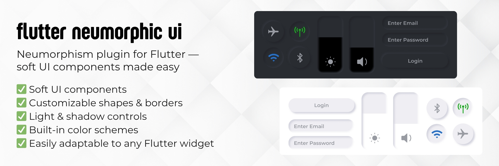

# 🔮 Flutter Neumorphic UI

A powerful and flexible Flutter package to create beautiful **neumorphic (soft UI)** elements that support deep customization across all widgets.

Inspired by skeuomorphic design principles, this package provides a modern, adaptive UI system with full support for light and dark themes, custom depth, light source, and styling options.

---


## ✨ Features

🌑 Light & Dark mode support  
🌕 Adjustable `depth`, `intensity`, `surfaceIntensity`  
🌈 Full color customization  
🧱 Widget-level control: Text, Icon, Button, Container, Slider, Toggle, etc.  
📐 Shape and box style customization (circle, stadium, beveled, etc.)  
🎛️ Interactive LightSource manipulation (dx, dy)  
👶 Beginner-friendly API  


## 🚀 Installation

Add the dependency in your `pubspec.yaml`:

```yaml
dependencies:
  flutter_neumorphic_ui: ^0.0.1
```

Then run:

```bash
flutter pub get
```

---

## 🛠️ Getting Started

Wrap your app with `NeumorphicTheme`:

```dart
import 'package:flutter_neumorphic_ui/flutter_neumorphic_ui.dart';

void main() {
  runApp(
    NeumorphicApp(
      debugShowCheckedModeBanner: false,
      theme: NeumorphicThemeData(
        baseColor: Color(0xFFE0E0E0),
        lightSource: LightSource.topLeft,
        depth: 6,
        intensity: 0.5,
      ),
      home: MyHomePage(),
    ),
  );
}
```

---

## 📦 Available Widgets

### 🔹 NeumorphicContainer

```dart
Neumorphic(
  style: NeumorphicStyle(
    depth: 4,
    color: Colors.grey[300],
    boxShape: NeumorphicBoxShape.roundRect(BorderRadius.circular(12)),
  ),
  child: Padding(
    padding: const EdgeInsets.all(16.0),
    child: Text("Neumorphic Box"),
  ),
)
```

---

### 🔹 NeumorphicButton

```dart
NeumorphicButton(
  onPressed: () {},
  style: NeumorphicStyle(
    depth: 6,
    boxShape: NeumorphicBoxShape.stadium(),
    color: Colors.purpleAccent,
  ),
  child: Text("Click Me", style: TextStyle(color: Colors.white)),
)
```

---

### 🔹 NeumorphicText

```dart
NeumorphicText(
  "Neumorphic",
  textStyle: NeumorphicTextStyle(
    fontSize: 36,
    fontWeight: FontWeight.w700,
  ),
  style: NeumorphicStyle(
    depth: 4,
    color: Colors.white,
  ),
)
```

---

### 🔹 NeumorphicSlider

```dart
NeumorphicSlider(
  min: 0,
  max: 100,
  value: sliderValue,
  onChanged: (value) => setState(() => sliderValue = value),
)
```

---

### 🔹 NeumorphicToggle

```dart
NeumorphicToggle(
  height: 40,
  selectedIndex: 0,
  displayForegroundOnlyIfSelected: true,
  children: [
    ToggleElement(child: Text("On")),
    ToggleElement(child: Text("Off")),
  ],
  thumb: Neumorphic(
    style: NeumorphicStyle(
      boxShape: NeumorphicBoxShape.circle(),
    ),
  ),
  onChanged: (index) => setState(() => toggleIndex = index),
)
```

---

## ⚙️ Customization Options

| Property           | Description                                                    |
| ------------------|--------------------------------------------------------------- |
| `depth`           | Controls shadow depth                                           |
| `intensity`       | Light/Shadow brightness                                         |
| `surfaceIntensity`| Surface reflection feel                                         |
| `boxShape`        | Round, Circle, Stadium, Beveled                                 |
| `lightSource`     | Direction of light (`topLeft`, `bottomRight`, or custom dx/dy)  |
| `color`           | Background color                                                |

---

## 🖤 Dark Mode

You can switch between light and dark modes with `themeMode`:

```dart
NeumorphicTheme(
  themeMode: ThemeMode.dark,
  darkTheme: NeumorphicThemeData(
    baseColor: Color(0xFF121212),
    depth: 6,
    intensity: 0.6,
    accentColor: Colors.deepPurple,
  ),
  child: MyHomePage(),
)
```
## 🤝 Contributions
  
